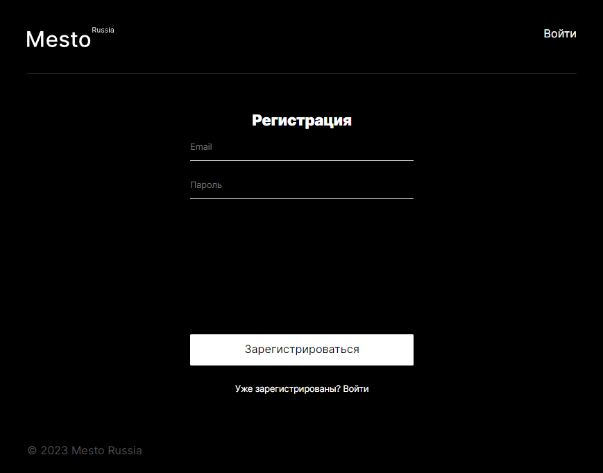

# Название проекта: **Mesto Russia**

## Описание проекта:
Сайт создан с целью ознакомления посетителей с интересными местами России, которые посетил указанный на странице путешественник. Места проиллюстрированы фотографиями.
## Технологии и функциональность:
* HTML
* CSS
* Разметка портирована в JSX.
* Flexbox
* JS
* Node.js
* React, CRA.
* Адаптивная верстка для разрешений от 320 до 1280 пикселей.
* BEM Nested
* Использован API Яндекс.Практикум.
* Использован Backend Яндекс.Практикум.
* Реализованы модальные окна добавления новой фотографии, изменения данных автора страницы, изменения аватара автора.
* Реализовано модальное окно просмотра фотографии.
* Реализовано добавления Лайка для фотографии, счетчик Лайков.
* Реализовано удаление фотографии.
* Настроен роутинг между страницами.
* Реализована регистрация и авторизация нового пользователя.
* Реализована работа с локальным хранилищем и токеном.

## Запуск проекта:
* Клонируйте репозиторий на свой компьютер
* Установите пакеты NPM командой npm install
* Запустите приложение командой npm start
* Если приложение не запустилось автоматически в браузере, откройте его самостоятельно - http://localhost:3000/mesto-react.
* Изменения отображаются на странице автоматически.

## Планы по доработке:
* Модальные окна закрываются по нажатию на Esc и по клику вне модального окна.
* Валидация форм через хук валидации React.
* Кнопка отправки формы неактивна, если хотя бы одно из полей не проходит валидацию.